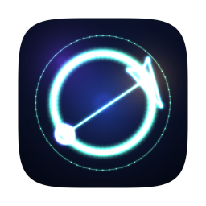
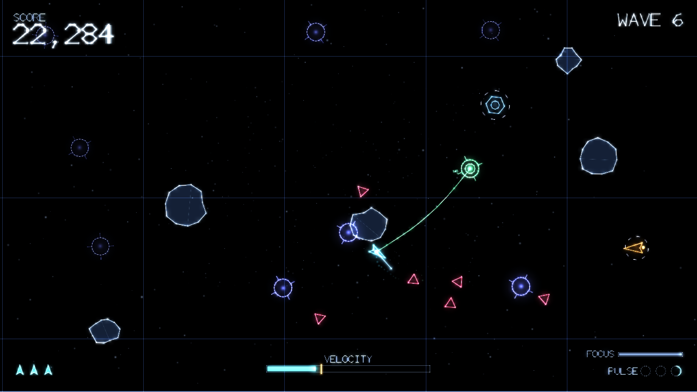

<div align="center">



# GRAVITON

**Swing. Slam. Survive.**

A neon-vector arena survival game for macOS.
You have no gun. You have a grappling hook and momentum, and that is the whole
weapon.



</div>

---

## The idea

Every enemy in GRAVITON has a **breaking speed**. Hit it faster than that and it
shatters. Hit it slower and it takes a life. That single rule is the entire
combat model, and it points the game in one direction: you are always trying to
go faster.

Thrusters alone will not get you there. What will is the **tether** — fire it at
one of the arena's pylons or at a drifting rock, let the rope go taut, and swing.
Reel in mid-arc and you convert radius into speed, the same way a skater pulls
their arms in. Let go at the right moment and you are launched across the arena
as a projectile.

So the loop is: build speed, spend it, survive the moment afterwards when you
have none left. A tethered rock is a second weapon — whip it into something and
it pays double.

There is no upgrade tree, no currency and no meta-progression. There is a run,
and how long you last in it.

## Playing it

| | Keyboard and mouse | Gamepad |
|---|---|---|
| Thrust | `W` `A` `S` `D` or arrows | Left stick |
| Aim | Mouse | Right stick |
| Tether (hold) | Left mouse | Right trigger |
| Reel in / pay out | Wheel, or `Q` / `E` | D-pad up / down |
| Pulse | Right mouse or `Space` | `A` |
| Focus (slow motion) | `Shift` | Left trigger |
| Pause | `Esc` | Start |
| Fullscreen | `F11` or `Cmd`+`F` | — |

**Pulse** is the panic button: it shoves everything nearby away and deletes
incoming fire. Three charges, and they come back slowly.

**Focus** slows the world to a crawl while you line up a swing. It drains fast
and refills when you are not using it — it buys you a decision, not an escape.

The **overdrive meter** along the bottom is the one to watch. Gold means you are
currently fast enough to break things. Every enemy also wears a ring: solid gold
when your present speed would destroy it, dim when it would not.

### What is out there

| | |
|---|---|
| **Drone** | Homes in on you. Fragile. Arrives in numbers. |
| **Lancer** | Winds up visibly, then dashes in a straight line. Sidestep it. |
| **Sentinel** | Keeps its distance and fires aimed plasma. |
| **Splitter** | Bursts into drones when it dies. Kill it somewhere with room. |
| **Warden** | Armoured miniboss every tenth wave. Needs a real run-up, or a rock. |

Three difficulties: **CADET**, **PILOT** and **ACE**. They change enemy speed,
spawn pressure and starting lives, and scale the score to match.

## Installing

Grab `GRAVITON.dmg` from a release, drag the app to Applications, and launch it
from there.

**On first launch**, macOS will refuse to open it: the build is signed ad-hoc
rather than with a paid Apple Developer ID, so Gatekeeper has nothing to check
against. Right-click (or Control-click) the app and choose **Open**, then
confirm. macOS remembers, and every launch after that is ordinary.

Requires macOS 11 (Big Sur) or later. Universal — one binary for Apple silicon
and Intel.

## Building it

The only dependency is SDL2.

```sh
brew install sdl2      # or drop SDL2.framework in /Library/Frameworks
make                   # build/graviton
make run
```

To build the macOS application bundle and a disk image:

```sh
make app               # dist/GRAVITON.app
make dmg               # dist/GRAVITON-1.0.0.dmg
```

`tools/build_macos.sh` does the packaging: it picks the architectures the
available SDL2 actually contains, copies SDL2 into the bundle and repoints the
executable at the copy, generates the icon, ad-hoc signs everything, and then
verifies with `otool` that nothing in the bundle still references a path that
will not exist on someone else's Mac.

For a universal build, use the official `SDL2.framework` from
[libsdl.org](https://github.com/libsdl-org/SDL/releases) rather than Homebrew's
single-architecture dylib. The script will find it in `/Library/Frameworks`,
`~/Library/Frameworks`, or a `Frameworks/` directory beside this file.

It builds and runs on Linux too (`sudo apt install libsdl2-dev`), which is how
it is developed and tested; only the packaging is macOS-specific.

## Testing it

```sh
make test        # 100 tests, ~500,000 assertions
make sanitize    # the same suite under AddressSanitizer + UBSan, leak checks on
make smoke       # drives the real application through every screen, headless
```

`make test` links only the platform-independent simulation, so it needs no
window, no audio device and no SDL at all. `make smoke` runs the *whole*
application — menus, renderer, mixer, save file — against SDL's dummy drivers,
walks every screen with synthetic input, plays two runs to completion, and
writes a screenshot of each screen to `build/shots` so the interface can be
reviewed without a display.

Both are green, and the smoke test is clean under ASan and UBSan as well.

The simulation is deterministic: fixed 120 Hz timestep, a seeded PCG32 stream
for gameplay and a second, separate one for cosmetic effects, and no floating
point that depends on frame rate. A seed replays exactly, which is what makes
the soak and fuzz tests meaningful.

## Where things are

```
src/core/     maths and RNG — no dependencies at all
src/game/     the simulation: player, tether, enemies, waves, collision, scoring
src/render/   neon vector renderer, HUD, menus, the built-in stroke font
src/audio/    procedural synthesiser and the adaptive soundtrack
src/app/      window, input, screens, settings and high scores
tests/        the simulation suite
tools/        screenshot, balance probe, headless smoke test, icon generator,
              macOS packaging
docs/         design and architecture notes
```

## No assets

There are no image files, no font files and no audio files anywhere in this
repository, and none inside the shipped app. Every texture is generated at
startup, the font is a single-stroke vector typeface built into the binary, the
icon is drawn with the game's own renderer, and every sound — including the
soundtrack — is synthesised sample by sample while you play.

See [docs/DESIGN.md](docs/DESIGN.md) for the game design and
[docs/ARCHITECTURE.md](docs/ARCHITECTURE.md) for how it is put together.

## Licence

MIT — see [LICENSE](LICENSE). SDL2 is redistributed inside the app bundle under
its own zlib licence, which travels with it.
